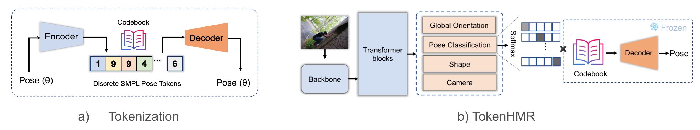
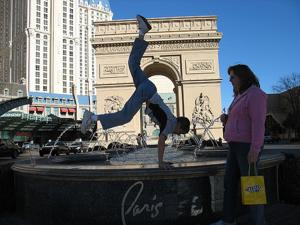
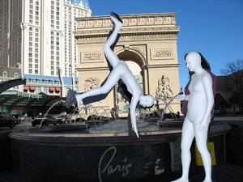

<h2 align="center"> <a href="https://tokenhmr.is.tue.mpg.de">TokenHMR: Advancing Human Mesh Recovery with a Tokenized Pose Representation</a></h2>

<h3 align="center">
    Computer Vision and Pattern Recognition (CVPR 2024)
</h3>

<div align="center"> 
    <a href="https://saidwivedi.in">Sai Kumar Dwivedi</a><sup><small>1,*</small></sup>,
    <a href="https://www.yusun.work">Yu Sun</a><sup><small>2,*</small></sup>,
    <a href="https://ps.is.mpg.de/person/ppatel">Priyanka Patel</a><sup><small>1</small></sup>,
    <a href="https://scholar.google.com/citations?user=wNQQhSIAAAAJ&hl=en&oi=ao">Yao Feng</a><sup><small>1,2,3</small></sup>,
    <a href="https://ps.is.mpg.de/person/black">Michael J. Black</a><sup><small>1</small></sup>
</div>

<div align="center" style="font-size: smaller;">
    (*equal contribution)
</div>
<br />

<div align="center"> 
<p style="text-align: center;"><span role="presentation" dir="ltr"><sup><small>1</small></sup>Max Planck Institute for Intelligent Systems, Tubingen, Germany<br /><sup><small>2</small></sup>Meshcapade&nbsp; &nbsp; &nbsp;<sup><small>3</small></sup>ETH Zurich</span></p>
<p style="text-align: center;"><span role="presentation" dir="ltr"></span></p>
<p></p>
</div>

<h5 align="center">

[](https://tokenhmr.is.tue.mpg.de) 
[](https://www.youtube.com/watch?v=Jgg_LfvoE4A)
[](https://arxiv.org/abs/2404.16752)
 
</h5>

<div style="display:flex;">
    
    
</div>


## Key Idea
Most 3D human pose estimation methods train on real images with 2D keypoints and/or 3D pseudo ground-truth which helps in generalization. However, methods trained on such data exhibit good image alignment but poor 3D accuracy. TokenHMR addresses that by introducing a Threshold-Adaptive Loss Scaling (TALS) loss and reformulating the body regression as token prediction. Our method has two stages: 
1. **Tokenization:** The encoder maps continuous poses to discrete pose tokens.
2. **TokenHMR:** During the training of human pose estimation, the pre-trained decoder provides a “vocabulary” of valid poses without imposing biases.

<div style="display:flex;">
    
</div>

## Setup and Installation

1. Clone the Repository
Clone the repository to your local machine:

    ```shell
    git clone https://github.com/saidwivedi/TokenHMR.git
    ```
2. Create a Conda Environment 
    
    Important: Do not use Python versions higher than 3.10.

    ```shell
    conda create -n tkhmr python=3.10
    ```
3. Install PyTorch

    Tested with PyTorch 2.1.0 and CUDA 11.8, but it can also work with lower versions.
    ```shell
    pip install torch==2.1.0 torchvision==0.16.0 torchaudio==2.1.0 --index-url https://download.pytorch.org/whl/cu118
    ```
4. Install Additional Dependencies

    Use the provided requirements.txt file to install additional dependencies.
    ```shell
    pip install -r requirements.txt
    ```

5. Install [Detectron2](https://github.com/facebookresearch/detectron2) for Image Demos 

    Ensure CUDA_HOME is set to the CUDA version installed with PyTorch.
    ```shell
    pip install git+https://github.com/facebookresearch/detectron2
    ```

6.  Install the forked version (fixed dependencies) of Human Tracker ([PHALP, CVPR 2022](https://github.com/brjathu/PHALP)) for Video Demos
    
    Ensure CUDA_HOME is set to the CUDA version installed with PyTorch.
    ```shell
    pip install git+https://github.com/saidwivedi/PHALP
    ```

## Code Structure
```shell
TokenHMR/
├── tokenization/               # Contains code for training, evaluating and running demo for Tokenization. [Method (a)]
│   └── tokenization_data/      # Training/evaluation data for Tokenization. [Check below how to download]
│   ... 
├── tokenhmr/                   # Contains code for training, evaluating and running demo for TokenHMR [Method (b)]
│   └── dataset_dir/            # Root directory for TokenHMR training
│       └── training_data/      # Training data for TokenHMR. [Check below how to download]
│       └── evaluation_data/    # Training data for TokenHMR. [Check below how to download]
│   ... 
├── data/                       # Basic data for setup
│   └── body_models/            # SMPL and SMPLH body models
│   └── checkpoints/            # Tokenization and TokenHMR checkpoints with config
├── requirements.txt            # dependencies list
└── ...
```

## Preparing Data for Basic Setup [required for demo]
All the files are uploaded to [project webpage](https://tokenhmr.is.tue.mpg.de). Downloading works only after you register and agree to the licenses.
Download the basic data (link [here]()) and unzip it and place it `./data`. This is required for running demo, training and evaluation. This includes [SMPL](https://smpl.is.tue.mpg.de/) and [SMPLH](https://github.com/vchoutas/smplx) body models, TokenHMR and Tokenization checkpoints and configs. Note that this does not include datasets. For training and evaluation datasets, refer to respective sections.

## Running TokenHMR Demo on Images
Make sure to install [Detectron2](https://github.com/facebookresearch/detectron2) before running demo for images. Check the installation guide for more details.

```shell
python tokenhmr/demo.py \
    --img_folder demo_sample/images/ \
    --batch_size=1 \
    --full_frame \
    --checkpoint data/checkpoints/tokenhmr_model.ckpt \
    --model_config data/checkpoints/model_config.yaml
```
<table>
  <tr>
    <td style="padding: 0 0 0 10px;"></td>
    <td style="padding: 0 20px 0 10px;"></td>
    <td style="padding: 0 0 0 10px;"></td>
    <td style="padding: 0 20px 0 10px;"></td>
  </tr>
</table>


## Running TokenHMR Demo on Videos
Make sure to installed the [forked version](https://github.com/saidwivedi/PHALP) of the original ([PHALP, CVPR 2022](https://github.com/brjathu/PHALP)). Check the installation guide for more details.

```shell
python tokenhmr/track.py \
    video.source=demo_sample/video/gymnasts.mp4 \
    render.colors=slahmr \
    +checkpoint=data/checkpoints/tokenhmr_model.ckpt \
    +model_config=data/checkpoints/model_config.yaml
```

<p align="center">
  
</p>


## Tokenization

### Data Preparation
We train the tokenizer with body only poses of [AMASS](https://amass.is.tue.mpg.de) and [MOYO](https://moyo.is.tue.mpg.de). The processed files for training and evaluation can be downloaded from [here](https://download.is.tue.mpg.de/download.php?domain=tokenhmr&sfile=tokenization_data.zip) (download only works after registering to project page). Unzip it after the download and the folder structure should look like
```shell
TokenHMR/
├── tokenization/ 
│   └── tokenization_data/          # Training/evaluation data for Tokenization.
│       └── smplh/
│           └── train/              # Train split
│               └── train_CMU.npz
│               ...
│           └── val/                # Validation split
│               └── val_MPI-Mosh.npz            
│               ...
└── ...
```

### Training
We train the tokenizer for 150K iterations on a single A100 Nvidia GPU which takes around 2 days.
```shell
cd tokenization
python train_poseVQ.py --cfg configs/tokenizer_amass_moyo.yaml
```

## TokenHMR

### Data Preparation
We use [BEDLAM](https://github.com/pixelite1201/BEDLAM) and [4DHumans](https://github.com/shubham-goel/4D-Humans) training data for TokenHMR training. Refer to [this](https://github.com/shubham-goel/4D-Humans?tab=readme-ov-file#training) to download 4D humans training tar files. For BEDLAM tar files, please download from our project page [here](https://download.is.tue.mpg.de/download.php?domain=tokenhmr&sfile=bedlam.tar.gz). For evaluation, please download the images directly from their respective websites: [3DPW](https://virtualhumans.mpi-inf.mpg.de/3DPW/) and [EMDB](https://eth-ait.github.io/emdb/). Metadata for evaluation can be downloaded [here](https://download.is.tue.mpg.de/download.php?domain=tokenhmr&sfile=test.tar.gz). The final folder structure should look like this
```shell
TokenHMR/
├── tokenhmr/
│   └── dataset_dir/
│       └── training_data/                      # Training data
│           └── dataset_tars/
│               └── coco-train-2014-pruned/
│               └── aic-train-vitpose/
│               └── bedlam/
|               ...                          
│           ...
│       └── evaluation_data/                    # Evaluation data
│           └── 3DPW/
│           └── EMDB/
│           └── emdb.npz
│           └── 3dpw_test.npz
└── ...
```
### Training
After training the tokenizer, we can train TokenHMR. If you want to skip the tokenization training, you can directly use the pretrained model provided in the checkpoint. With 4DHumans pretrained backbone, it training takes around 4 days on 4 A100 Nvidia GPUs. If you want to change any default settings, please update `tokenhmr/lib/configs_hydra/experiment/tokenhmr_release.yaml`.
```shell
python tokenhmr/train.py datasets=mix_all experiment=tokenhmr_release
``` 

### Evaluation
To evaluate the model on 3DPW and EMDB, run this

```shell
python tokenhmr/eval.py  \
    --dataset EMDB,3DPW-TEST \
    --batch_size 32 --log_freq 50 \
    --dataset_dir tokenhmr/dataset_dir/evaluation_data \
    --checkpoint data/checkpoints/tokenhmr_model.ckpt \
    --model_config data/checkpoints/model_config.yaml
```

## Acknowledgements

The code is built on top of these two awesome repositories. I thank the authors for opensourcing their code.

- [4DHumans](https://github.com/shubham-goel/4D-Humans) 
- [TM2-GPT](https://github.com/Mael-zys/T2M-GPT)

Parts of the code are taken or adapted from the following repos:
- [BEDLAM](https://github.com/pixelite1201/BEDLAM)
- [POCO](https://github.com/saidwivedi/POCO)
- [VPoser](https://github.com/nghorbani/human_body_prior)


We sincerely thank the department of Perceiving Systems and ML team of Meshcapade GmbH for insightful discussions and feedback. We thank the International Max Planck Research School for Intelligent Systems (IMPRS-IS) for supporting Sai Kumar Dwivedi. We thank Meshcapade GmbH for supporting Yu Sun and providing GPU resources. This work was partially supported by the German Federal Ministry of Education and Research (BMBF): Tübingen AI Center, FKZ: 01IS18039B.

## Citation
If you find this code useful for your research, please consider citing the following paper:

```bibtex
@inproceedings{dwivedi_cvpr2024_tokenhmr,
    title={{TokenHMR}: Advancing Human Mesh Recovery with a Tokenized Pose Representation},
    author={Dwivedi, Sai Kumar and Sun, Yu and Patel, Priyanka and Feng, Yao and Black, Michael J.},
    booktitle={IEEE/CVF Conference on Computer Vision and Pattern Recognition (CVPR)},
    year={2024},
}
```

## License

This code is available for **non-commercial scientific research purposes** as defined in the [LICENSE file](LICENSE). By downloading and using this code you agree to the terms in the [LICENSE](LICENSE). Third-party datasets and software are subject to their respective licenses.

## Contact

For code related questions, please contact sai.dwivedi@tuebingen.mpg.de

For commercial licensing (and all related questions for business applications), please contact ps-licensing@tue.mpg.de.


